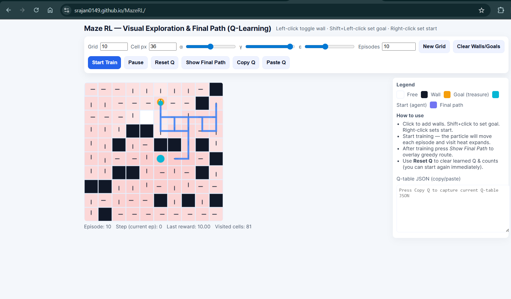

```markdown
# 🧭 MazeRL — Interactive Q-Learning Maze Simulator

[](https://srajan0149.github.io/MazeRL/)
[](https://opensource.org/licenses/MIT)

MazeRL is an elegant, interactive web-based visualization tool that brings **Q-Learning** to life in a grid-based maze environment. Design custom mazes, train an RL agent, fine-tune hyperparameters, and witness optimal paths emerge—all seamlessly within your browser.



---

## 🚀 Overview

Dive into a comprehensive playground for mastering Reinforcement Learning with MazeRL:

- **Craft Custom Mazes**: Build environments tailored to your experiments.
- **Tune Q-Learning Parameters**: Adjust learning dynamics in real-time.
- **Visualize Learning**: Watch the agent evolve through animated exploration and heatmaps.
- **Export & Import**: Preserve and share Q-tables for advanced workflows.
- **Optimal Path Rendering**: Reveal the agent's learned policy with a single click.

Powered by pure client-side JavaScript, MazeRL requires no installation or backend—pure, premium interactivity at your fingertips.

---

## ✨ Features

### 🧱 Interactive Maze Builder
- **Left-click**: Toggle walls to shape your maze.
- **Shift + Left-click**: Designate the goal (treasure).
- **Right-click**: Position the start (agent).
- **Dynamic Sizing**: Customize grid and cell dimensions.
- **Responsive Canvas**: Adapts effortlessly to your screen.

### 🤖 Real-Time Q-Learning Engine
- **Hyperparameter Control**:
  - **α (Alpha)**: Learning rate for updates.
  - **γ (Gamma)**: Discount factor for future rewards.
  - **ε (Epsilon)**: Exploration-exploitation balance.
- **Flexible Training**: Run from quick tests to extensive sessions.
- **Granular Control**: Step through episodes, pause, resume, or halt anytime.
- **Live Updates**: Observe Q-table evolution in real-time.

### 🎬 Immersive Training Visualization
- **Animated Exploration**: See the agent navigate dynamically.
- **Visit Heatmaps**: Color-coded insights into cell frequencies.
- **Visual Highlights**:
  - Walls, start, goal, and agent position.
- **Speed Adjustment**: Control animation pace for detailed analysis.
- **Final Path Display**: Unveil the optimal greedy trajectory post-training.

### 📄 Advanced Q-Table Tools
- **Export Q-Table**: Copy as JSON for external use.
- **Import Q-Table**: Restore saved states seamlessly.
- **Reset Functionality**: Wipe Q-values and visit data for fresh starts.
- **Adaptive Expansion**: Q-table grows with grid changes.

---

## 🕹️ How to Use

### 1️⃣ Build Your Maze
- **Walls**: Left-click to erect barriers.
- **Goal**: Shift + Left-click to place the treasure.
- **Start**: Right-click to set the agent's origin.

### 2️⃣ Configure RL Settings
Fine-tune:
- Grid and cell sizes.
- Episode count.
- α, γ, ε values for precise control.

### 3️⃣ Train the Agent
Leverage intuitive controls:
- **Start Train**: Initiate learning.
- **Pause**: Suspend and resume at will.
- **Step Ep**: Advance one episode at a time.
- **Stop**: End the session.
- **Reset Q**: Clear knowledge and heatmaps.

Observe:
- Agent animations.
- Q-value refinements.
- Evolving visit patterns.

### 4️⃣ Explore Results
- **Show Final Path**: Render the optimal policy.
- **Import/Export**: Continue training across sessions.

---

## 🎛️ Controls Summary

### 🖱 Mouse Controls
| Action      | Control            |
|-------------|--------------------|
| Toggle Wall | Left-click         |
| Set Goal    | Shift + Left-click |
| Set Start   | Right-click        |

### 🔘 Button Controls
| Button         | Function                   |
|----------------|----------------------------|
| Start Train    | Begin training process     |
| Pause          | Pause/resume training      |
| Step Ep        | Execute a single episode   |
| Stop           | Halt training              |
| Reset Q        | Clear Q-table and visits   |
| Show Final Path| Display optimal greedy path|
| Copy Q         | Export Q-table (JSON)      |
| Paste Q        | Import Q-table             |

### ⌨️ Keyboard Shortcuts
- **Space**: Pause/Resume training  
- **P**: Show final path  
- **R**: Reset Q-table  

---

## 🧠 Q-Learning Deep Dive

**State Space**  
Each grid cell (row, column) represents a unique state.

**Actions**  
- Up  
- Right  
- Down  
- Left  

**Reward Function**  
| Event      | Reward |
|------------|--------|
| Move       | -0.04  |
| Hit Wall   | -0.6   |
| Reach Goal | +10    |

**Q-Update Equation**
```text
Q(s, a) ← Q(s, a) + α [reward + γ max(Q(s', a')) - Q(s, a)]
```

**Policy**  
Epsilon-Greedy Exploration:
- With probability ε: Select a random action.  
- With probability 1 - ε: Choose the action with the highest Q-value.  

---

## 📁 Project Structure
```text
MazeRL/
│── index.html
│── script.js
│── styles.css
│── demo.png
│── README.md
└── assets/
```

---

## 🌐 Live Demo
Experience MazeRL in action:  
[https://srajan0149.github.io/MazeRL/](https://srajan0149.github.io/MazeRL/)

---

## 📜 License
This project is licensed under the MIT License. Feel free to explore, modify, and share.

---

Crafted with precision for an unparalleled RL learning experience.
```
